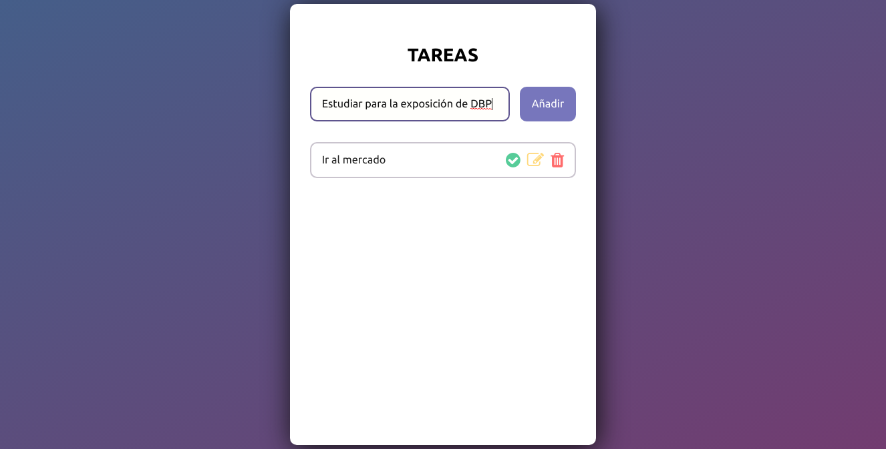
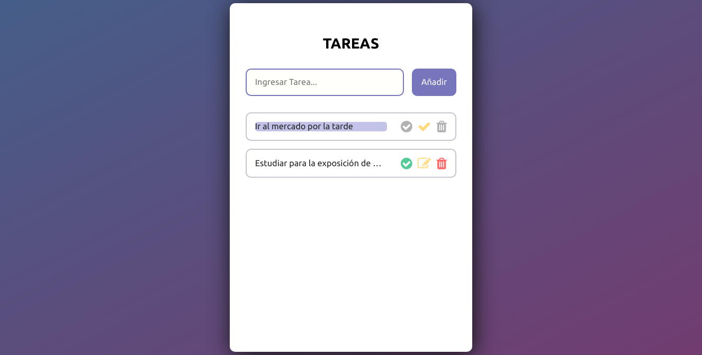
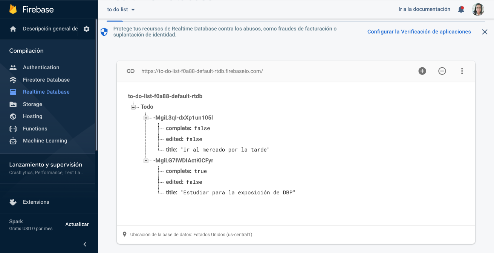
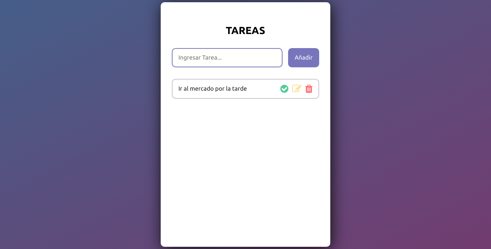
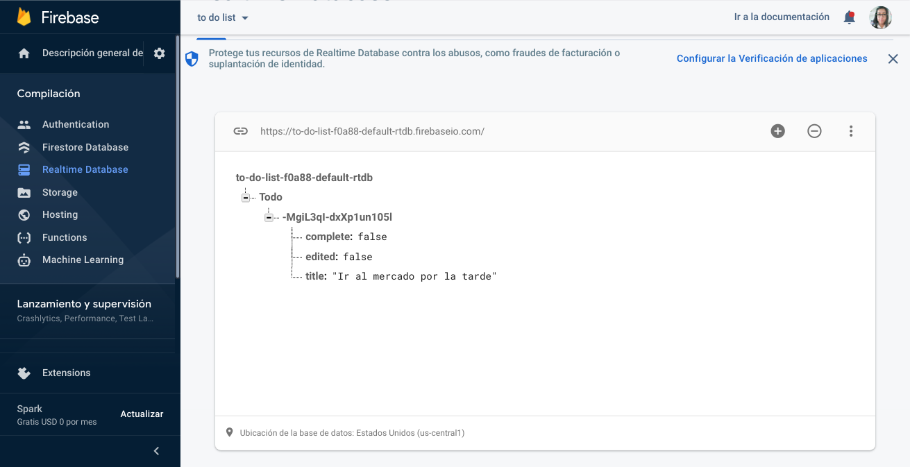
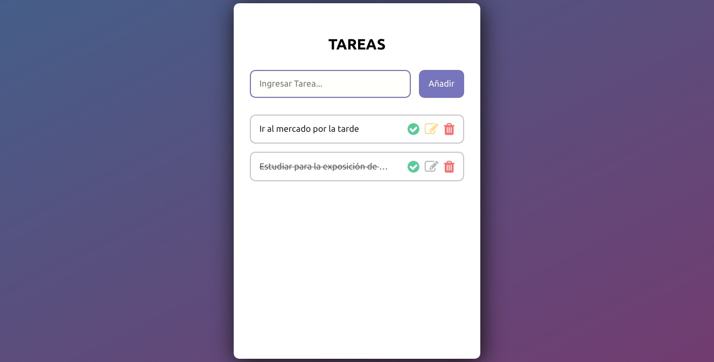

# PROYECTO FINAL: APLICACIÓN WEB DE TODO LIST :memo:
_AUTORES: Jenny Huanca Anquise y Manuel Ángel Nifla Llallacachsi_

**Video del funcionamiento:** https://cutt.ly/PQU609x  (Restringido al ámbito de la UNSA)

## Introducción
Como parte de las herramientas de gestión y organización de tiempo tenemos a la _To Do List_. 

Una ToDo List es un inventario o lista de todas las tareas que deben realizarse en un día u otro periodo de tiempo corto. 

Nuestra aplicación web tiene como finalidad desarrollar una ToDo List virtual práctica y portable que se sincronice en tiempo real con los datos en la nube

## Tecnologías empleadas
- Editor: Visual Studio Code
- Frontend: ReactJS y Extensión React Developer Tools 
- Base de Datos: Firebase -Realtime DataBase
- Otros: Node.js o Yarn. Html y css 

## Instalación e Inicio
1. Debe tener instalado **Node y NPM** para poder instalar **React**.  En caso de no querer trabajar el manejo de módulos con Node, puede usar en su lugar **Yarn**
2. Clonar el repositorio y abrir la carpeta de instalación
3. Instalar los módulos necesarios usando `npm install` o `yarn install`
3. Iniciar la aplicación con el comando `npm start` o `yarn start`
4. Abrir el navegador en `localhost:3000` para ver la ejecución de la aplicación.
5. Para trabajar sobre esta aplicación se recomienda el uso de la extensión **React Developer Tools** para ver el funcionamiento de los componentes y su estado.

## Funcionalidades
- El usuario puede agregar un nuevo ítem desde la pantalla principal escribiendo la tarea sobre el campo de texto y haciendo clic en "Añadir" o pulsando Enter.
  

- El usuario puede modificar un ítem agregado anteriormente. Se debe pulsar sobre el ícono amarillo del lápiz.
  
  
  
  

- El usuario puede eliminar un ítem agregado anteriormente. Basta con presionar el ícono rojo del tacho de basura.
  

  
  
- El usuario puede marcar una tarea como completada. Cuando se complete una tarea presione el ícono verde con la figura de aspa.
  
  
- Los datos se almacenan en tiempo real en una base de datos en la nube. (Firebase)
  

- Los datos se pueden recuperar desde cualquier dispositivo conectado a internet
